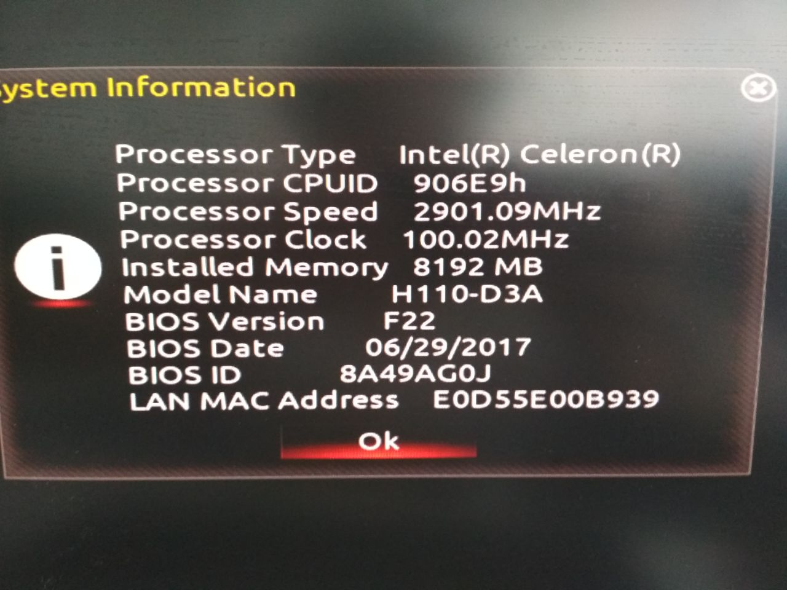
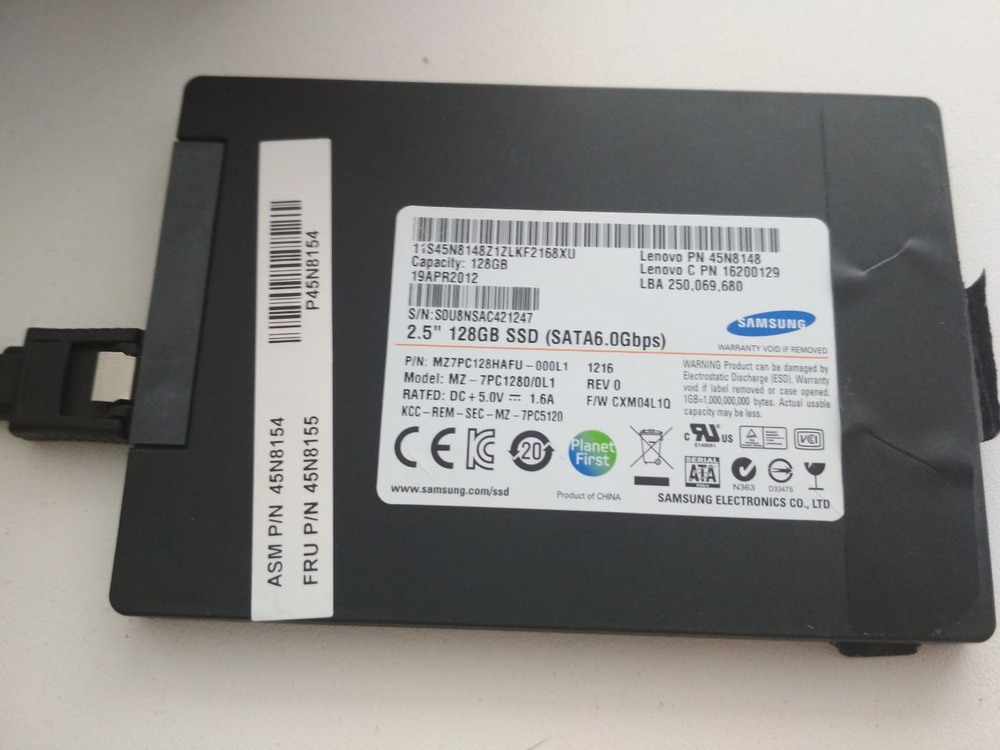
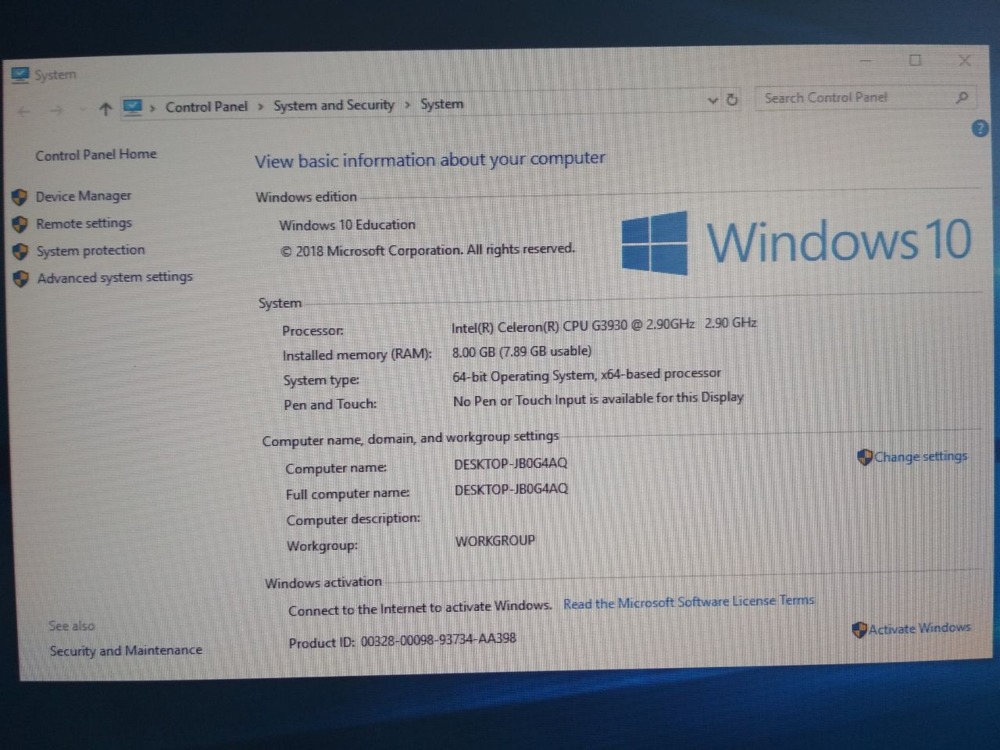

# Following by Halderman

**Q**. Where does the name *“Lest We Remember”* come from?

**A.** This is the name of a short story by *Isaac Asimov* published in
*The Winds of Change and Other Stories*.

## Plan

**Inspired by:** Halderman, J. A., Schoen, S. D., Heninger, N., Clarkson, W.,
Paul, W., Calandrino, J. A., Feldman, A. J., Appelbaum, J. & Felten, E. W. (2008).
Lest We Remember: Cold Boot Attacks on Encryption Keys..
In P. C. van Oorschot (ed.), USENIX Security Symposium (p./pp. 45-60),
: USENIX Association. ISBN: 978-1-931971-60-7
 -- <https://www.usenix.org/legacy/event/sec08/tech/full_papers/halderman/halderman.pdf>
 -- `references/halderman.pdf`

**Halderman's experiment:**

- <https://citp.princeton.edu/research/memory/exp/>

```python
#!/usr/bin/env python
# a pirate's favorite chemical element
a = ""
while 1: a += "ARGON"
```

- Run and wait Disk Activity, which means swap has come in play
- Cutting-off Hard Reset
- Run Linux And Find **ARGON** pattern in memory

```bash
sudo strings /dev/mem | less
```

**Resources:**

- Software: <https://citp.princeton.edu/research/memory/>
    - <https://freedom-to-tinker.com/2008/02/21/new-research-result-cold-boot-attacks-disk-encryption/>
    - <https://citp.princeton.edu/research/memory/faq/>
    - <https://citp.princeton.edu/research/memory/exp/>
    - <https://citp.princeton.edu/research/memory/code/>
- Workstation:
    - `Ubuntu 18.04.2 LTS`
    - `4.18.0-18-generic`
    - *Motherboard/Boot*: `1998/UEFI`
    - `Intel(R) Core(TM) i5-4590 CPU @ 3.30GHz`
    - RAM: `16.7 GB (15.6 GiB)`
    - Graphics: `Advanced Micro Devices,
      Inc. [AMD/ATI] Caicos XTX [Radeon HD 8490 / R5 235X OEM]`
    - VirtualBox: `$(VBoxManage --version) == "5.2.18_Ubuntur123745"`







```bash
scripts$ git clone git@github.com:DonnchaC/coldboot-attacks.git
```

## Build Utilities

### Signature Verification

```bash
$ gpg --receive-keys B8841A919D0FACE4
gpg: key B8841A919D0FACE4: 68 signatures not checked due to missing keys
gpg: key B8841A919D0FACE4: public key "Jacob Appelbaum <jacob@appelbaum.net>" imported
```

```bash
$ gpg --verify bios_memimage-1.2.tar.gz.asc
gpg: assuming signed data in 'bios_memimage-1.2.tar.gz'
gpg: Signature made Чт 12 фев 2009 16:50:39 MSK
gpg:                using DSA key B8841A919D0FACE4
gpg: Good signature from "Jacob Appelbaum <jacob@appelbaum.net>" [expired]
gpg: Note: This key has expired!
Primary key fingerprint: 12E4 04FF D3C9 31F9 3405  2D06 B884 1A91 9D0F ACE4
```

```bash
$ gpg --verify efi_memimage-1.0.tar.gz.asc
gpg: assuming signed data in 'efi_memimage-1.0.tar.gz'
gpg: Signature made Пт 18 июл 2008 21:51:53 MSD
gpg:                using DSA key B8841A919D0FACE4
gpg: Good signature from "Jacob Appelbaum <jacob@appelbaum.net>" [expired]
gpg: Note: This key has expired!
Primary key fingerprint: 12E4 04FF D3C9 31F9 3405  2D06 B884 1A91 9D0F ACE4
```

```bash
$ gpg --verify aeskeyfind-1.0.tar.gz.asc
gpg: assuming signed data in 'aeskeyfind-1.0.tar.gz'
gpg: Signature made Пт 18 июл 2008 21:52:04 MSD
gpg:                using DSA key B8841A919D0FACE4
gpg: Good signature from "Jacob Appelbaum <jacob@appelbaum.net>" [expired]
gpg: Note: This key has expired!
Primary key fingerprint: 12E4 04FF D3C9 31F9 3405  2D06 B884 1A91 9D0F ACE4
```

```bash
$ gpg --verify rsakeyfind-1.0.tar.gz.asc
gpg: assuming signed data in 'rsakeyfind-1.0.tar.gz'
gpg: Signature made Пт 18 июл 2008 21:51:48 MSD
gpg:                using DSA key B8841A919D0FACE4
gpg: Good signature from "Jacob Appelbaum <jacob@appelbaum.net>" [expired]
gpg: Note: This key has expired!
Primary key fingerprint: 12E4 04FF D3C9 31F9 3405  2D06 B884 1A91 9D0F ACE4
```

```bash
$ gpg --verify aesfix-1.0.1.tar.gz.asc
gpg: assuming signed data in 'aesfix-1.0.1.tar.gz'
gpg: Signature made Пт 18 июл 2008 21:52:09 MSD
gpg:                using DSA key B8841A919D0FACE4
gpg: Good signature from "Jacob Appelbaum <jacob@appelbaum.net>" [expired]
gpg: Note: This key has expired!
Primary key fingerprint: 12E4 04FF D3C9 31F9 3405  2D06 B884 1A91 9D0F ACE4
```

### bios_memimage-1.2.tar.gz

*Note:* project initially was written for 32bit systems and x86_64 was not tested
much, but should work. Currently, we are interested in x86_64.

- build x86_64 compiler

```text
# mk.64
# ...
CC=/home/suhoy/bin/gcc-8.3.0-x86_64-elf/bin/x86_64-elf-gcc
AR=/home/suhoy/bin/gcc-8.3.0-x86_64-elf/bin/x86_64-elf-ar
AS=/home/suhoy/bin/gcc-8.3.0-x86_64-elf/bin/x86_64-elf-as
AS=/home/suhoy/bin/gcc-8.3.0-x86_64-elf/bin/x86_64-elf-ld
OBJCOPY=/home/suhoy/bin/gcc-8.3.0-x86_64-elf/bin/x86_64-elf-objcopy
```

```bash
source mk.64
make -f Makefile.64

cp pxe/scraper.bin ./bin/pxe_scraper.bin
cp usb/scraper.bin ./bin/usb_scraper.bin
cp pxedump/pxedump ./bin/
cp usbdump/usbdump ./bin/
```

### efi_memimage-1.2.tar.gz

- exist for old 32bit EFI application. We do not consider this tool

### aeskeyfind-1.0.tar.gz

```bash
make
cp aeskeyfind ../bin
```

### rsakeyfind-1.0.tar.gz

- Patch headers to use undeclared standard functions:

```C
// rsakeyfind.cpp
#include <string.h>
#include <unistd.h>
```

```bash
make
cp rsakeyfind ../bin
```

### aesfix-1.0.1.tar.gz.asc

```bash
make
cp aesfix ../bin
```

## VirtualBox Experiments

- Download image of Windows 10 from: <https://developer.microsoft.com/en-us/windows/downloads/virtual-machines>

### Extracting Secret Cookie

**Objective:** Demonstrate wanted effect on virtual machine example.

- Put Cookie: `Hello, Crazy World!` in the running browser (`images/VirtualBox_WinDev1903Eval_14_05_2019_08_14_31-cookie.png`)

- Dump RAM with VirtualBox tool:

```bash
VBoxManage debugvm "WinDev1903Eval" dumpvmcore --filename dump.ram
```

- Find the cookie with `grep`:

```bash
strings dump.ram | grep "Hello, Crazy World!"
```


### Extracting AES key from BitLocker

**Objective:** test `aeskeyfind` utility

- Shrink Disk Space, and Increase performance (RAM, CPU) of VM
- Allow Policy to run BitLocker without TPM: <https://www.howtogeek.com/howto/6229/how-to-use-bitlocker-on-drives-without-tpm/>
- Enable BitLocker encryption
- Reboot and wait for finishing BitLocker progress (PowerShell or GUI):

```powershell
# PowerShell with Admin right
watch(1) {manage-bde -status c:; sleep 2}
```

- Ensure that BitLocker uses AES


- Dump the RAM:

```bash
VBoxManage debugvm "WinDev1903Eval" dumpvmcore --filename dump.ram
```

- find the AES key (*Note:* we use `sort | uniq`, the tool found in memory not
only one copy of AES keys):

```bash
scripts/coldboot-attacks/bin/aeskeyfind dump.ram

scripts/coldboot-attacks/bin/aeskeyfind dump.ram
4ffa2b21ca45676f321739cef00db137
bd91534fca3e27b74969b8c7dc856805
```

- Boot from `Ubuntu Mate Live ISO`
- First, try to mount BitLocker drive with known password: <https://www.ceos3c.com/open-source/open-bitlocker-drive-linux/>

```bash
sudo apt-get update
sudo apt-get install dislocker
sudo mkdir /media/bitlocker /media/mount
sudo fdisk -l # Target: /dev/sda2
sudo dislocker -r -V /dev/sda2 -uYourPassword -- /media/bitlocker
sudo mount -t ntfs -o ro /media/bitlocker/dislocker-file /media/mount
```


```bash
sudo umount /media/mount && sudo umount /media/bitlocker
```

- Try to mount the Encrypted Disk (Reboot for clearness):

```bash
sudo apt-get update
sudo apt-get install libbde-utils
sudo fdisk -l # Target: /dev/sda2
sudo bdemount -k 4ffa2b21ca45676f321739cef00db137:bd91534fca3e27b74969b8c7dc856805\
/dev/sda2 /mnt
sudo mount -t ntfs -o ro /mnt/bde1 /media
# ...
```


### Extracting RSA key from ssh/git-bash

**Objective:** test `rsakeyfind` utility

- Roll-back to non-encrypted stage
- Install `git-bash`
- Generate RSA keys
- Establish SSH connection
- Dump the RAM
- Find private RSA key
- Compare extracted and real keys

**Skipped...**

## Target Hardware Experiments

### Dumping with USB

```bash
umount /dev/sdb*
dd if=usb_scraper.bin of=/dev/sdb && sync && sync
```

- Run PC with Windows 10
- Put Cookie: `Hello, Crazy Hardware World!`
- Power Cutting-Off Reset
- Boot from USB with scrapper

### Dumping with PXE

### Extracting AES key from BitLocker
