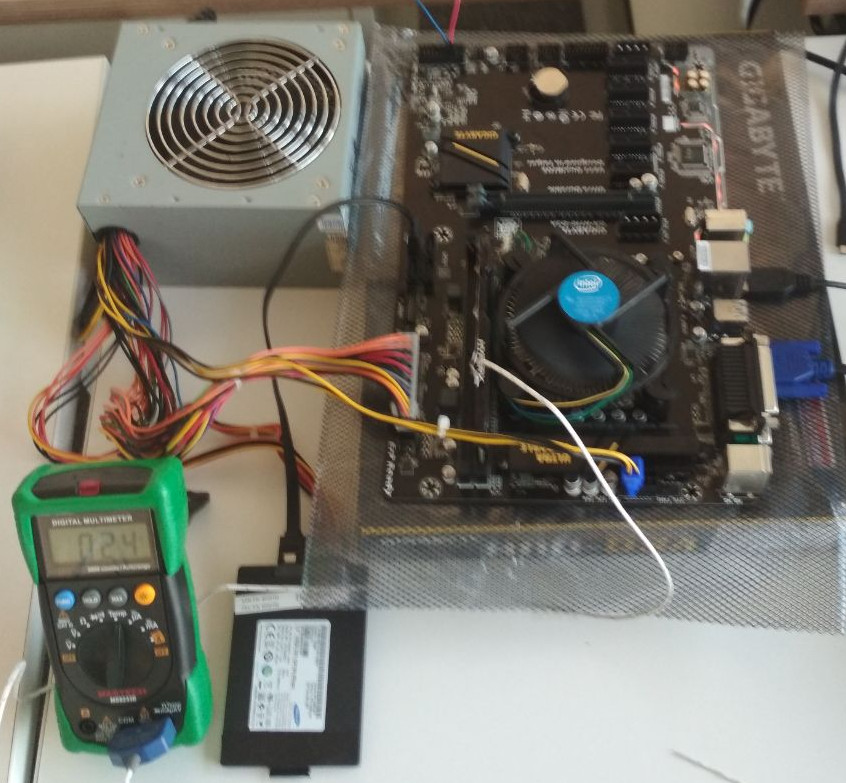
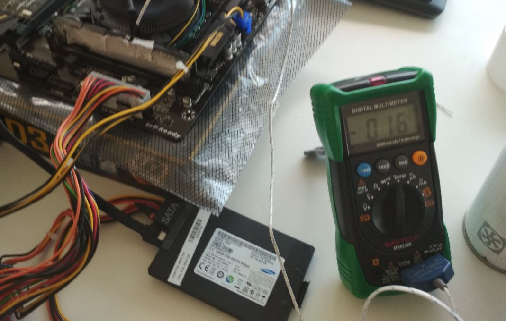
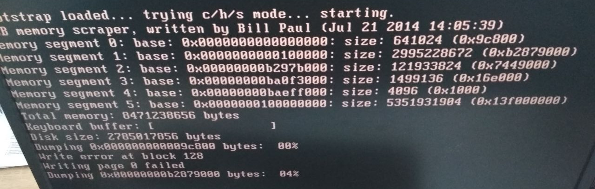
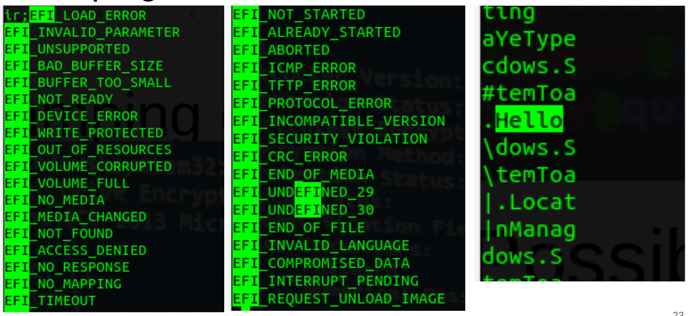

# Preface

**Q:** *Know what the difference between your latest project and
putting wings on an elephant is?*\
**A:** *Who knows? The elephant \*might\* fly, heh, heh...*\
*Author unknown, future's quotes*

This is a report for CCF research project. The research was dedicated to
practical reproducing the results of
[Lest We Remember (2008)](https://citp.princeton.edu/research/memory/) work.
The interest was to create own live RAM content acquisition method.
Though by the time of writing the report there is no final practical
results, we hope this work will become a good theoretical guideline to concentrate
on particular solutions.

*Notice:* to easy remember the last tasks, they are marked with **TODO:**.

\tableofcontents

# Introduction

In 2008, Alex Halderman showed that wide-spread assumption about RAM volatility
in the engineering projects is not so correct. He published a paper and
described methods of how to dump DRAM without any special hardware, and provided
further examples of exploiting this phenomenon in security perspectives. In 2010,
following Halderman's steps, Freddie Witherden described passive and active
attacks on RAM of running machine via IEEE 1379 (a.k.a. FireWire) and analyzed
pros and cons of different methods in RAM data acquisition.

Now in 2019, We, as pre-graduated masters with some work experience, may say
that this security moment is still not considered during software development.
Because of this and the urge to repeat Halderman's experiments, we have started
this work.

## Subject

Although the main subject of this work was the reproducing Cold-Boot attack
and \textit{extraction of RAM state}, it is worth to theoretically consider
this topic wider as \textit{Extraction Of Running Machine State}. This task
rename define more wide and precise understanding in goals of
professional data acquisition procedure in forensic science.

## Goal and Targets

**Goal:** Make a theoretical overview of DRAM data acquisition methods.
Perform and validate Cold-Boot and Hot-Boot attack to extract the DRAM state.

**Common targets:**

- Get insights about the art of writing operating systems\footnote{<https://wiki.osdev.org/Main\_Page>}
- Understand and practically face with `x86` architecture as most wide-spread
and technologies related to address spaces
- Test and explore the Halderman's tools set\footnote{<http://citp.princeton.edu/memory>},
particularly `findkey` tool for extraction of DES/AES/RSA keys from RAM image
- Implement a tiny kernel to feel bitmap picture into RAM
- Implement a tiny kernel to image DRAM and save it to the USB storage device
and/or network storage
- Try to experiment and observe RAM data degradation after power-off the PC
- Try to perform Hot-Boot attack to retrieve the state of running
regular operating system
- Try to perform Cold-Boot attack with 'canned-air' to transits the RAM boards
to the attacker hardware and take its image

## Novelty

Citing the Witherden [[2, 2010]](https://freddie.witherden.org/pages/ieee-1394-forensics.pdf),
this work is more evolutionary than revolutionary. We are trying to validate
and actualize the described methods and their implementation. But we have
a new idea for the field, while we have not found similar ideas in other works.

Halderman mentioned the using of the well-known predictable motherboard
to mitigate the BIOS intervention during acquisition, but it sounds
hypothetical. In optional part, we would like to try to build the Open Source BIOS
solution -- Coreboot -- in perspective a method of creating such predictable
motherboard. Moreover, this method hypothetically leads to the creation of special
hardware for RAM data acquisition, which does not require any mini kernel solution
as it was described by Halderman.

## Security Consideration

Mostly, the subject covers a big blind spot in physical security.
As soon as the optimal tools and programs appear, the security methods of
Full Disk Encryption technologies and approach of programming the secure
or cryptography application may become more questionable in their possibility
of providing confidentiality.

On another hand, the particle results can increase the performance
of forensics specialist in the live acquisition situation, which should bread
a new wave of obfuscation and anti-acquisition technics.

## Political Consideration

The internal Russian political situation is considered as unstable.
The reputations of some malicious users and person from special service are
approximately equaled if we take the general situation. So, we do not tend to
create a new production-ready technical solution, but only validation of
existing implementation and clarification of this scientific field. Thus, this aspect
is only to facilitate our tasks.

## Law Consideration

In the perfect scenario, if such tools appear in the current environment,
then it should be certified and controlled by responsible special service.
Observing the current physical security in the organizations, the unlimited
exploiting of these techniques may lead to  attacks on wealthy businesses,
particularly banking systems, and in terrorist hands, it may become a weapon
against government infrastructures, such as police, medicine, and other
bureaucracy organizations.

# Experiments

## Halderman's experiment

- <https://citp.princeton.edu/research/memory/exp/>

```python
#!/usr/bin/env python
# a pirate's favorite chemical element
a = ""
while 1: a += "ARGON"
```

- Run and wait for Disk Activity, which means swap has come in play
- Cutting-off Hard Reset
- Run Linux And Find **ARGON** pattern in memory

```bash
sudo strings /dev/mem | less
```

**Result:** current default Linux kernel does not allow read more than 1MiB
of RAM. In the NetBSD reading from `/dev/mem` leads to rebooting system. Thus,
it is required to understand the underlying mapping structure of RAM memory to
work with that way now.

\clearpage

## Breaking BitLocker in VirtualBox

*Note:* Building of published tools are placed in the Appendix

- Download image of Windows 10 from <https://developer.microsoft.com/en-us/windows/downloads/virtual-machines>
- Shrink Disk Space, and Increase performance (RAM, CPU) of VM
- Allow Policy to run BitLocker without TPM: <https://www.howtogeek.com/howto/6229/how-to-use-bitlocker-on-drives-without-tpm/>
- Enable BitLocker encryption
- Reboot and wait for finishing BitLocker progress (PowerShell or GUI):

```PowerShell
watch(1) {manage-bde -status c:; sleep 2} # admin right required
```

- Ensure that BitLocker uses AES
- Dump the RAM:

```bash
VBoxManage debugvm "WinDev1903Eval" dumpvmcore --filename dump.ram
```

- find the AES key:

```bash
scripts/coldboot-attacks/bin/aeskeyfind dump.ram
4ffa2b21ca45676f321739cef00db137
bd91534fca3e27b74969b8c7dc856805
```

- Boot from `Ubuntu Mate Live ISO`
- First, try to mount BitLocker drive with known password: <https://www.ceos3c.com/open-source/open-bitlocker-drive-linux/>

```bash
sudo apt-get update
sudo apt-get install dislocker
sudo mkdir /media/bitlocker /media/mount
sudo fdisk -l # Target: /dev/sda2
sudo dislocker -r -V /dev/sda2 -uYourPassword -- /media/bitlocker
sudo mount -t ntfs -o ro /media/bitlocker/dislocker-file /media/mount
# ...
sudo umount /media/mount && sudo umount /media/bitlocker
```

- Mount the Encrypted Disk with AES keys (Reboot for clearness):

```bash
sudo apt-get update
sudo apt-get install libbde-utils
sudo fdisk -l # Target: /dev/sda2
sudo bdemount -k 4ffa2b21ca45676f321739cef00db137:bd91534fca3e27b74969b8c7dc856805\
/dev/sda2 /mnt
sudo mount -t ntfs -o ro /mnt/bde1 /media
# ...
sudo umount /media/mount && sudo umount /media/bitlocker
```


## Further VM experiments

- **TODO:** test different types of BitLocker configuration
- **TODO:** test the `rsakeyfind` utility

## Dumping Memory from Hardware

### Target host configuration

- Motherboard: `Gigabyte H110-D3A`
- PCU: Intel Celeron
- DRAM: `HyperX Fury DDR4` / `HX424C15FB2K2/16`.
[spec](https://www.kingston.com/dataSheets/HX424C15FB2K2_16.pdf),
[product page](https://www.hyperxgaming.com/en/memory/fury-ddr4)
- Multimeter with temperature sensor

### Preparing scrapper USB

The built 64-bit scrapper from `bios_memimage` sources did not work.

**TODO:** It is hard to accept, but we forgot to try to build 32-bit version.

We found built utilities (`scripts/Scraper_32-bit.zip`). Use `dd` to
place `scraper.bin` on the zeroed USB stick.

To obtain the dumped memory, you can investigate USB content directly, or
use `usbdump`-utility to extract RAM to the memory. *Notice:* if the `usbdump`
from an archive does not work, try to build it from sources.

### Experiment photo




\begin{figure}[h!]
    \centering
    \includegraphics[height=1\textwidth]{./images/Hard-3.jpg}
    \caption{Used canned Air obtained from DNS shop}
\end{figure}






\clearpage



### Possible fail reasons

- More than 4 GiB. But the `dump.ram` is 7.9 GB
- Write error in the USB scrapper (look at the photo)
- Do not believe in binaries from the Internet
- Bad BIOS/hardware, which corrupts the previous memory state
- DDR4 degrades too fast

# Building Memory Scrapper

The most time of research was dedicated to understanding how to create the system
to dump the RAM content. Generally, it may be split into three parts:
Hardware solution, BIOS-based solutions, and OS-based solutions.

**Big advice: each of this way is challenging engineering and/or programming work.
Even one of them may easily occupy more than one month. So try to concentrate
on the one and NOT SWITCH to another until you find strong reasons to
not continue chosen way.*We guess it requires by RAM manufacturers.*

## Hardware-based solutions

**Advantages:** the method may be clear and simple from engendering point of view.
You will not fight against BIOS and other software baggage. Just simple controlling
of the parallel bus interface.

**Possible difficulties:**

1. If the DDR memory works only on high frequency, and it
is not possible to read it on low frequency, then you will fight with physics:
to correctly read from the parallel interface the length of wires should be very
accurate. It requires a Printed Circuit Board (PCB), that increase the time of
development, so be patient.
2. The work can be facilitated by obtaining the appropriate FPGA board, such
as [NanoBoard 3000 Series](https://techdocs.altium.com/display/HWARE/NanoBoard+3000+Series).
But it would be great to find a board with mounted DDR2/3/4 slots. This board is
expensive, so it would be better to borrow it from known laboratories.

### Useful resources

- <https://xdevs.com/a/ddr4s/> -- DDR DIMM SPD Adapter for Raspberry Pi
-- good simple example of this work. But we are interesting not only SPD.
- Find the DataSheet according the serial number. For example: `HX424C15FB2K2/16`
-- <https://www.kingston.com/dataSheets/HX424C15FB2K2_16.pdf>
- The Trade-Mark site contains a good description and explanation of the
RAM properties: <https://www.hyperxgaming.com/en/memory/fury-ddr4>
- <https://www.hyperxgaming.com/en/decoder> -- calculator to decode serial number
meaning.
- <https://www.jedec.org/standards-documents/docs/jesd79-4a>
-- DDR4 SDRAM STANDARD -- We guess it requires by RAM manufacturers
- DDR4 SDRAM UDIMM Design Specification -- this specification helps to understand
the physical configuration of device.

*Note:* <https://www.jedec.org/workshops-2019> -- the world is preparing for DDR5
standard.

## BIOS-based solutions

**Advantages:** You still may control the writing to the RAM during boot.

**Possible difficulties:**

1. The engineering skill is required. You can easily brick your device, but
with patience and reading manual it is possible to overcome.
2. Find appropriate motherboard with target RAM slots, and memory chip to
reprogram it.

### Useful links

- **TODO:** Look at products certified by "Respect Your Freedom":
<https://www.fsf.org/resources/hw/endorsement/respects-your-freedom>

### u-boot

- <http://www.denx.de/wiki/DULG/WebHome>
- <https://github.com/u-boot/u-boot>

The U-Boot provides a bootloader for Embedded PowerPC, ARM and MIPS Systems.

- It has memory display command: <http://www.denx.de/wiki/view/DULG/UBootCmdGroupMemory#Section_5.9.2.5.>
-- it could be base for dumping RAM utility.

- **TODO:** find an appropriate motherboard with DDR slots.

### coreboot

- <https://coreboot.org/>
- <https://doc.coreboot.org/>
- <https://www.flashrom.org/Flashrom> -- **TODO:** explore utility to reprogram
BIOS flash chip. *Note:* Raspberry Pi with SOIC-8 clips could be used as
programming device
- **TODO:** coreboot compatible motherboard
- **TODO:** program coreboot payload for dumping RAM memory.

## OS-based solutions

### Mini-kernel

This way is described in
[Lest We Remember (2008)](https://citp.princeton.edu/research/memory/) work.
The available sources require fixing. But it requires low-level
understanding the x86 works. The [OSDev.org](https://wiki.osdev.org/Main_Page)
could help with that. But it also requires additional time for a basic example.

The current state: <https://github.com/Suhoy95/dumplier/tree/master/Sources>

**TODO: The approximate plan.**

- Learn how to obtain and print information about hardware configuration. Particularly,
CPU capabilities and limit pf available physical RAM.
- Learn work with segmentation: GDT, LDT and interrupts (
[GDT tutorial](https://wiki.osdev.org/GDT_Tutorial),
[GDT](https://wiki.osdev.org/GDT),
[LDT](https://wiki.osdev.org/LDT),
[Interrupt Service Routines](https://wiki.osdev.org/Interrupt_Service_Routines)).
- Learn how to switch from Real mode to Protected mode and vice versa. It is
required to not pull USB driver into the mini kernel, but using BIOS functions
([Real Mode](https://wiki.osdev.org/Real_Mode),
[Protected Mode](https://wiki.osdev.org/Protected_Mode)).
- Learn how to use BIOS functions ([BIOS](https://wiki.osdev.org/BIOS))
- Learn how to configure paging and PAE. (
[Setting Up Paging](https://wiki.osdev.org/Setting_Up_Paging),
[Setting Up Paging With PAE](https://wiki.osdev.org/Setting_Up_Paging_With_PAE))

### Patching GRUB

### Custom Linux Kernel

# Summary

# References

1. Halderman, J. A., Schoen, S. D., Heninger, N., Clarkson, W., Paul, W.,
Calandrino, J. A., Feldman, A. J., Appelbaum, J. & Felten, E. W. (2008).
Lest We Remember: Cold Boot Attacks on Encryption Keys..
In P. C. van Oorschot (ed.), USENIX Security Symposium (p./pp. 45-60),
: USENIX Association. ISBN: 978-1-931971-60-7
 -- <https://www.usenix.org/legacy/event/sec08/tech/full_papers/halderman/halderman.pdf>
 -- `references/halderman.pdf`
2. Witherden, F.D. (2010). Memory Forensics over the IEEE 1394 Interface.
-- <https://freddie.witherden.org/pages/ieee-1394-forensics.pdf>
-- `references/ieee-1394-forensics.pdf`
3. Steven Levy. 1984. Hackers: Heroes of the Computer Revolution.
Doubleday, New York, NY, USA.

<!--
3. USB -- Undermining Security Barriers, Andy Davis, `references/BH_US_11-Davis_USB_WP.pdf`
4. Salave, P. (2017). Memory Forensics : Tools Comparison.
-- https://pdfs.semanticscholar.org/791c/c8805bc1e02192a96e211b7daf6e8cf2799e.pdf
-- `references/memory-forensics-tools-comparison.pdf`
5.
https://www.semanticscholar.org/paper/Memory-forensics%3A-The-path-forward-Case-Richard/b358feb9c8f2704aa742ff69ab04d04766468146
3. TODO: add more, request for help
-->

# Appendix

## A. Building tools from Cold-Boot Attack

### Signature Verification

```bash
$ gpg --receive-keys B8841A919D0FACE4
gpg: key B8841A919D0FACE4: 68 signatures not checked due to missing keys
gpg: key B8841A919D0FACE4: public key "Jacob Appelbaum <jacob@appelbaum.net>" imported
```

```bash
$ gpg --verify bios_memimage-1.2.tar.gz.asc
gpg: assuming signed data in 'bios_memimage-1.2.tar.gz'
gpg: Signature made Чт 12 фев 2009 16:50:39 MSK
gpg:                using DSA key B8841A919D0FACE4
gpg: Good signature from "Jacob Appelbaum <jacob@appelbaum.net>" [expired]
gpg: Note: This key has expired!
Primary key fingerprint: 12E4 04FF D3C9 31F9 3405  2D06 B884 1A91 9D0F ACE4
```

```bash
$ gpg --verify efi_memimage-1.0.tar.gz.asc
gpg: assuming signed data in 'efi_memimage-1.0.tar.gz'
gpg: Signature made Пт 18 июл 2008 21:51:53 MSD
gpg:                using DSA key B8841A919D0FACE4
gpg: Good signature from "Jacob Appelbaum <jacob@appelbaum.net>" [expired]
gpg: Note: This key has expired!
Primary key fingerprint: 12E4 04FF D3C9 31F9 3405  2D06 B884 1A91 9D0F ACE4
```

```bash
$ gpg --verify aeskeyfind-1.0.tar.gz.asc
gpg: assuming signed data in 'aeskeyfind-1.0.tar.gz'
gpg: Signature made Пт 18 июл 2008 21:52:04 MSD
gpg:                using DSA key B8841A919D0FACE4
gpg: Good signature from "Jacob Appelbaum <jacob@appelbaum.net>" [expired]
gpg: Note: This key has expired!
Primary key fingerprint: 12E4 04FF D3C9 31F9 3405  2D06 B884 1A91 9D0F ACE4
```

```bash
$ gpg --verify rsakeyfind-1.0.tar.gz.asc
gpg: assuming signed data in 'rsakeyfind-1.0.tar.gz'
gpg: Signature made Пт 18 июл 2008 21:51:48 MSD
gpg:                using DSA key B8841A919D0FACE4
gpg: Good signature from "Jacob Appelbaum <jacob@appelbaum.net>" [expired]
gpg: Note: This key has expired!
Primary key fingerprint: 12E4 04FF D3C9 31F9 3405  2D06 B884 1A91 9D0F ACE4
```

```bash
$ gpg --verify aesfix-1.0.1.tar.gz.asc
gpg: assuming signed data in 'aesfix-1.0.1.tar.gz'
gpg: Signature made Пт 18 июл 2008 21:52:09 MSD
gpg:                using DSA key B8841A919D0FACE4
gpg: Good signature from "Jacob Appelbaum <jacob@appelbaum.net>" [expired]
gpg: Note: This key has expired!
Primary key fingerprint: 12E4 04FF D3C9 31F9 3405  2D06 B884 1A91 9D0F ACE4
```

### bios_memimage-1.2.tar.gz

*Note:* project initially was written for 32bit systems and x86_64 was not tested
much, but should work. Currently, we are interested in x86_64.

- build x86_64 compiler. *Note:* host x86_64 compiler should be enough.

```text
# mk.64
# ...
CC=/home/suhoy/bin/gcc-8.3.0-x86_64-elf/bin/x86_64-elf-gcc
AR=/home/suhoy/bin/gcc-8.3.0-x86_64-elf/bin/x86_64-elf-ar
AS=/home/suhoy/bin/gcc-8.3.0-x86_64-elf/bin/x86_64-elf-as
AS=/home/suhoy/bin/gcc-8.3.0-x86_64-elf/bin/x86_64-elf-ld
OBJCOPY=/home/suhoy/bin/gcc-8.3.0-x86_64-elf/bin/x86_64-elf-objcopy
```

```bash
source mk.64
make -f Makefile.64

cp pxe/scraper.bin ./bin/pxe_scraper.bin
cp usb/scraper.bin ./bin/usb_scraper.bin
cp pxedump/pxedump ./bin/
cp usbdump/usbdump ./bin/
```

### efi_memimage-1.2.tar.gz

- exist for old 32bit EFI application. We do not consider this tool

### aeskeyfind-1.0.tar.gz

```bash
make
cp aeskeyfind ../bin
```

### rsakeyfind-1.0.tar.gz

- Patch headers to use undeclared standard functions:

```C
// rsakeyfind.cpp
#include <string.h>
#include <unistd.h>
```

```bash
make
cp rsakeyfind ../bin
```

### aesfix-1.0.1.tar.gz.asc

```bash
make
cp aesfix ../bin
```