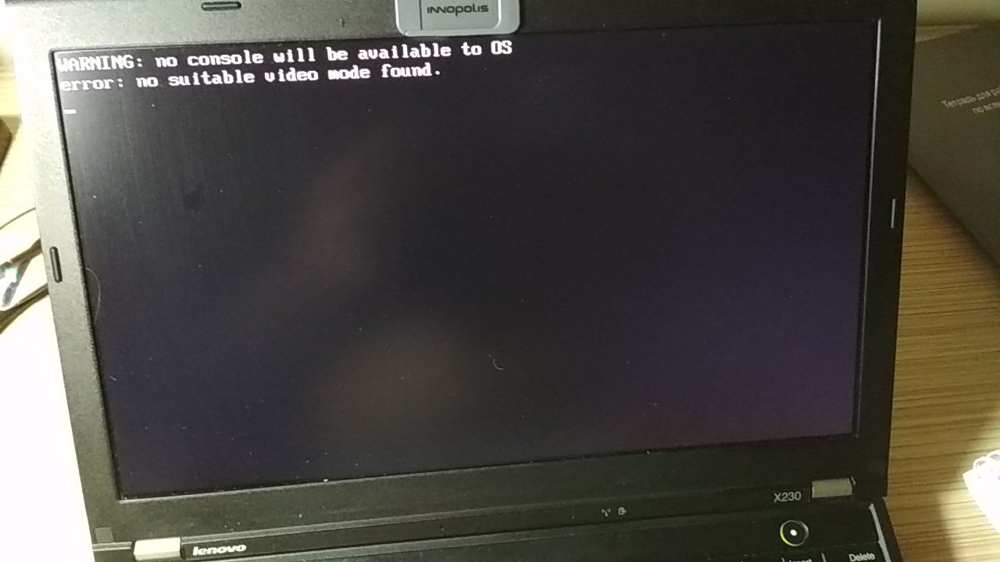

# Bare Bones

- <https://wiki.osdev.org/Bare_Bones>

## Compiling

```bash
i686-elf-as boot.s -o boot.o
i686-elf-gcc -c kernel.c -o kernel.o -std=gnu99 -ffreestanding -O2 -Wall -Wextra
i686-elf-gcc -T linker.ld -o bare-bones.bin -ffreestanding -O2 -nostdlib boot.o kernel.o -lgcc
```

## Verifying Multiboot

```bash
grub-file --is-x86-multiboot bare-bones.bin
# > return 0 == success
```

## Booting The Kernel

```bash
rm -rf isodir && mkdir -p isodir/boot/grub
cp bare-bones.bin isodir/boot/bare-bones.bin
cp grub.cfg isodir/boot/grub/grub.cfg
# sudo apt-get install xorriso
grub-mkrescue -o bare-bones.iso isodir
```

## Testing (QEMU)

```bash
qemu-system-i386 -cdrom bare-bones.iso
qemu-system-i386 -kernel bare-bones.bin
```

## Testing (Real HW)

```bash
sudo dd if=bare-bones.iso of=/dev/sdb && sync
```


